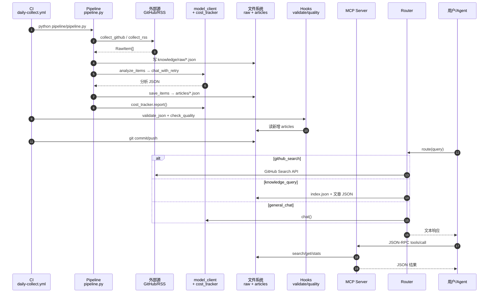
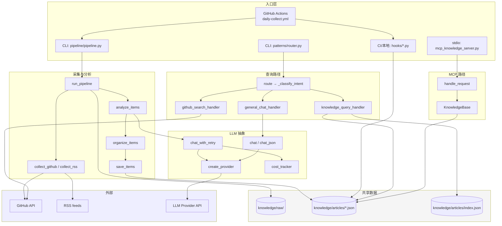
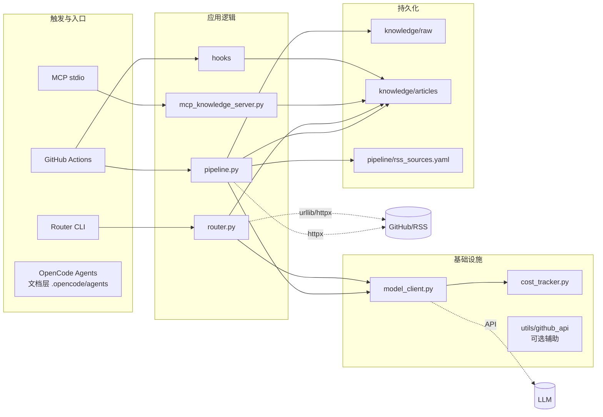

## 项目调用堆栈总览（v1-skeleton）

基于 `.understand-anything/knowledge-graph.json` 与源码，本项目是**多条并行入口**、**共享 `knowledge/articles/` 数据层**，而不是单一 `main()` 树。

| 泳道（角色）    | 典型入口                          | 核心调用链                                                                  | 外部依赖                    |
| --------------- | --------------------------------- | --------------------------------------------------------------------------- | --------------------------- |
| **CI / 运维**   | `daily-collect.yml`               | workflow → `pipeline.py` → hooks → `git push`                               | GitHub Actions、Secrets     |
| **采集流水线**  | `python pipeline/pipeline.py`     | `main` → `run_pipeline` → Collect → Analyze → Organize → Save               | GitHub API、RSS、LLM API    |
| **LLM 层**      | 被 pipeline / router 调用         | `chat_with_retry` / `chat` / `chat_json` → `create_provider` → httpx/Claude | DeepSeek / Qwen / Claude    |
| **查询 Router** | `patterns/router.route()`         | 分类 → 三选一 handler                                                       | GitHub API、本地 index、LLM |
| **MCP 服务**    | `mcp_knowledge_server.py` (stdio) | JSON-RPC → `KnowledgeBase`                                                  | 仅读本地 JSON               |
| **质量门禁**    | hooks CLI                         | `validate_json` / `check_quality`                                           | 无                          |

图谱中的 **导览顺序** 也对应主价值链：规范 → 流水线 → hooks → MCP/Router → CI。

---

### 1. 采集流水线调用堆栈（最深、最完整）

```
daily-collect.yml (或 CLI)
└─ pipeline.pipeline.main()
   └─ run_pipeline(sources, limit, dry_run, rss_config)
      ├─ collect_github(limit)
      │  └─ httpx → api.github.com/search/repositories
      ├─ collect_rss(limit)
      │  ├─ load_rss_sources(rss_sources.yaml)
      │  └─ httpx → 各 RSS URL
      ├─ 写入 knowledge/raw/pipeline-raw-*.json
      ├─ analyze_items(collected)
      │  ├─ create_provider()
      │  └─ 每条 RawItem:
      │     ├─ _build_analysis_prompt(item)
      │     ├─ chat_with_retry(messages)          ← pipeline/model_client.py
      │     │  └─ provider.chat → 记录 cost_tracker
      │     ├─ _parse_analysis_response(...)
      │     └─ _item_to_article(...)
      ├─ organize_items(analyzed)
      │  └─ _normalize_article / _validate_article / 按 URL 去重
      └─ save_items(organized)
         └─ knowledge/articles/{id}.json
   └─ get_cost_tracker().report()
```

CI 在 pipeline 之后还会：

```
git diff 新增 articles/*.json
→ hooks/validate_json.py
→ hooks/check_quality.py
→ git commit & push
```

---

### 2. Router 调用堆栈（用户对话入口）

```
patterns/router.route(query)
└─ _classify_intent(normalized_query)
   ├─ [Layer 1] _keyword_route() → 命中则返回 intent
   └─ [Layer 2] chat_json(classifier prompt)     ← workflows 或 pipeline model_client
      └─ 失败 → general_chat
├─ github_search → github_search_handler
│  └─ urllib → GitHub Search API
├─ knowledge_query → knowledge_query_handler
│  ├─ _load_articles() → index.json 或目录扫描
│  ├─ _enrich_article()（index 缺 summary 时读真实 JSON）
│  └─ _score_article() / _summarize_hits()
└─ general_chat → general_chat_handler
   └─ chat(messages)
```

Router **不写库**；与 pipeline **无直接 import**，只共享 `knowledge/articles/`。

---

### 3. MCP 调用堆栈（IDE/Agent 工具协议）

```
mcp_knowledge_server.main()
└─ 循环读 stdin JSON-RPC
   └─ McpKnowledgeServer.handle_request(req)
      ├─ initialize / tools/list
      └─ tools/call
         ├─ search_articles → KnowledgeBase.search_articles
         ├─ get_article     → KnowledgeBase.get_article
         └─ knowledge_stats → KnowledgeBase.knowledge_stats
            └─ glob + json.loads(knowledge/articles/*.json)
```

MCP **不调 LLM**；检索逻辑与 router 的打分策略不同（MCP 偏简单 keyword count）。

---

## Mermaid：泳道图（端到端主路径）



---

## Mermaid：调用堆栈树（按入口分栏）



---

## Mermaid：架构泳道（静态分层 + 调用方向）



---

### 要点归纳

1. **写路径唯一主链**：`run_pipeline` → `knowledge/articles/`；CI 再挂 hooks 与提交。
2. **读路径两条**：`router`（自然语言字符串）与 `MCP`（结构化工具），都读同一目录，实现独立。
3. **LLM 集中点**：`pipeline/model_client.py`（router 通过 `workflows` 或 `pipeline` 别名引入）。
4. **图谱边较少**：静态分析只抓到 `model_client → cost_tracker`、测试 import；运行时还有 httpx/urllib 与 LLM，需在理解时补全。

若要针对**某一个入口**（例如只画 `route("查知识库 n8n")` 或只画 CI 一次 run）做成更细的 sequenceDiagram，可以说一下场景我单独展开。
